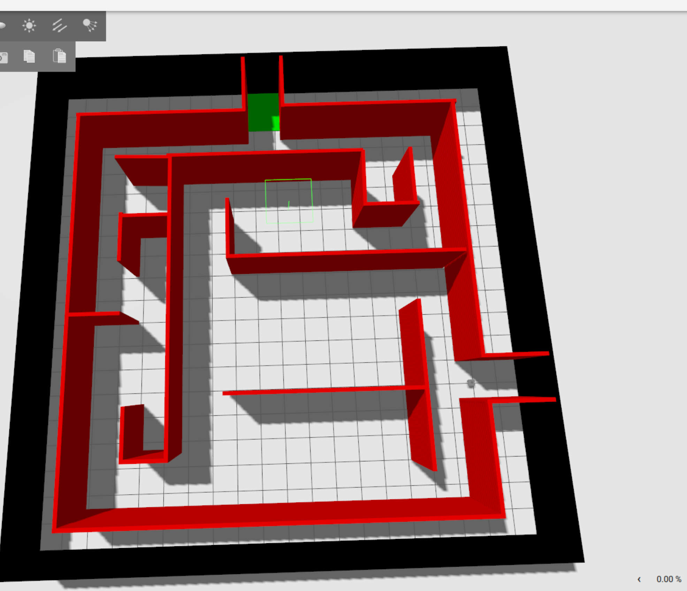

# LF Maze Challenge


Build an Lingua Franca-based controller for an autonomous robot trying to find the exit of a maze!

## TODOs:
- [ ] Test with macOS
- [ ] Create a Ubuntu VM for Windows people
- [ ] Add automatic detection of reaching the goal area
- [ ] Add odometry 
- [ ] Add example using the lidar scan data
- [ ] Document the robot (sensors and actuators)
- [ ] Give credits to creators of the Maze model and Turtle bot model

## Requirements
- Linux (tested Ubuntu 24.04 and 22.04)
- macOS (Not tested yet)
- git
- A C compiler such as `gcc` or `clang`
- A recent version of `cmake`

## Getting started

### All platforms
#### Clone this repo

```sh
git clone git@github.com:erlingrj/lf-maze-challenge.git --recursive
```

or 

```sh
git clone https://github.com/erlingrj/lf-maze-challenge.git --recursive
```

#### Install nightly version of LFC
```sh
curl -Ls https://install.lf-lang.org | bash -s cli nightly
```

### Linux/Ubuntu

### Gazebo simulator
Following the guide [here](https://gazebosim.org/docs/harmonic/install_ubuntu/), 
install Gazebo Harmonic with:
```sh
sudo apt-get update
sudo apt-get install curl lsb-release gnupg
sudo curl https://packages.osrfoundation.org/gazebo.gpg --output /usr/share/keyrings/pkgs-osrf-archive-keyring.gpg
echo "deb [arch=$(dpkg --print-architecture) signed-by=/usr/share/keyrings/pkgs-osrf-archive-keyring.gpg] http://packages.osrfoundation.org/gazebo/ubuntu-stable $(lsb_release -cs) main" | sudo tee /etc/apt/sources.list.d/gazebo-stable.list > /dev/null
sudo apt-get update
sudo apt-get install gz-harmonic
```

### Eigen

```sh
sudo apt libeigen3-dev
```


### MacOS

#### Gazebo simulator
```sh
brew tap osrf/simulation
brew install gz-harmonic
```

#### Eigen
```sh
brew install eigen
```

### Verify installations

1. Lingua Franca Compiler
```sh
lfc --version
lfc src/HelloWorld.lf
bin/HelloWorld
```


2. Gazebo
```sh
gz sim --version
gz sim models/model.sdf
```

Press the "Play" button in the lower left corner.

In another terminal run:

```sh
gz topic -e -t /lidar --json-output
```

This should flood the terminal with LiDAR scan messages.


## Examples

This repo provides two examples showing how to interact with the simulated robot.

1. Spinning robot
Will simply just make the robot spin:
```sh
lfc src/Spinning.lf
bin/Spinning
```


2. Random walk
This example will have the robot drive around in random directions:
```sh
lfc src/StupidRobot.lf
bin/StupidRobot
```

